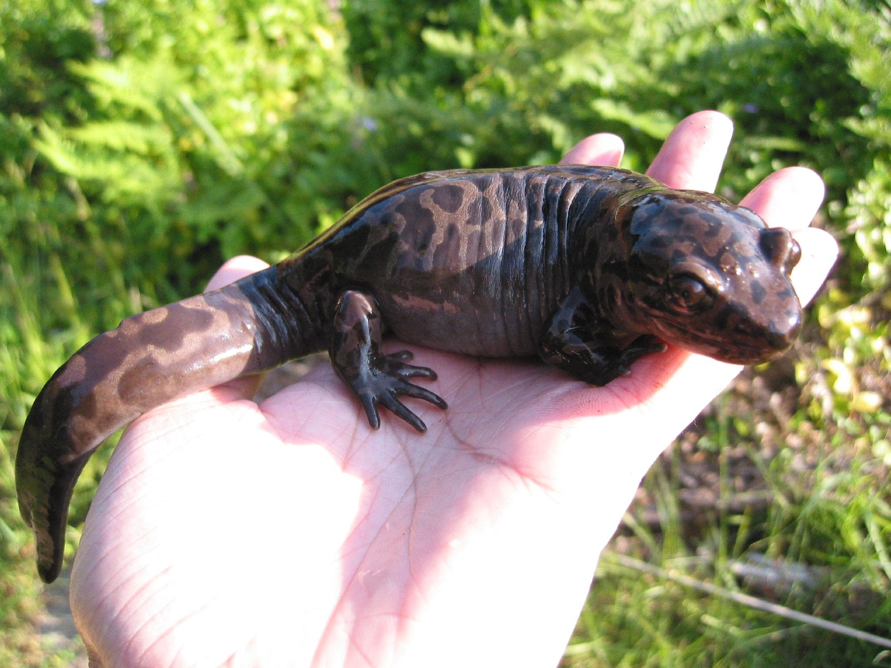
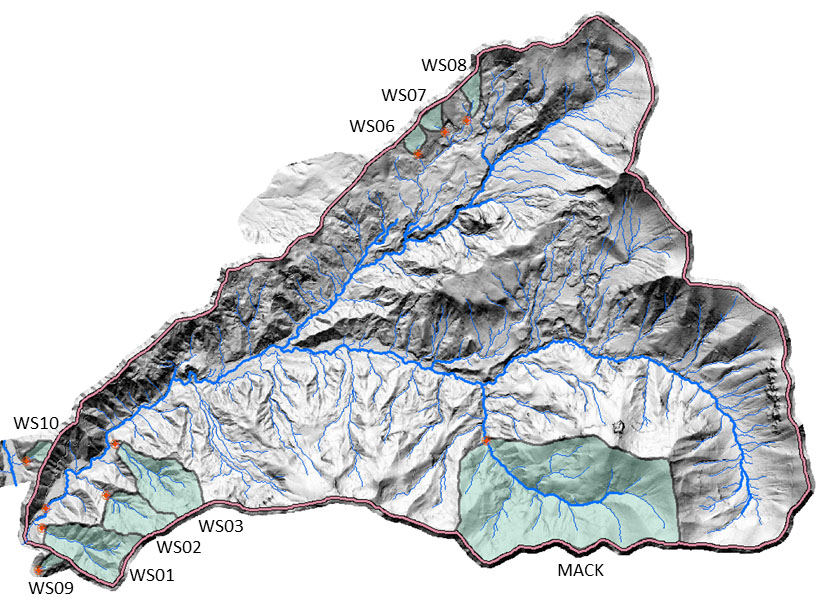
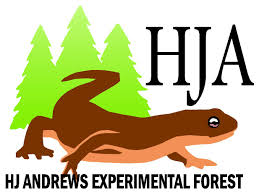

```{r setup, echo = FALSE, message = FALSE, warning = FALSE, cache = FALSE}
knitr::opts_chunk$set(echo = FALSE, message = FALSE, warning = FALSE, cache = FALSE)
```


```{r}
# -------------------------------------------
# Attach packages
# -------------------------------------------

library(tidyverse)
library(janitor)
library(here)
library(RColorBrewer)
library(tidyr)
library(directlabels)
library(plotly)
library(effsize)
library(kableExtra)
library(ggbeeswarm)
library(praise)
library(car)

```

## Introduction

Ecosystem services provided by production forests of the Pacific Northwest are necessary for the health of our economy, our environment, and our society and culture. The timber extraction technique of clear cutting forests is commonly used in the Pacific Northwest region, but it has been widely criticized for negatively impacting biodiversity^[Seedre, M., Felton, A. & Lindbladh, M. What is the impact of continuous cover forestry compared to clearcut forestry on stand-level biodiversity in boreal and temperate forests? A systematic review protocol. Environ Evid 7, 28 (2018) doi:10.1186/s13750-018-0138-y]. In order to study the effects of clear cutting on biodiversity, researchers in Oregon have been monitoring populations of the Pacific Giant Salamander, *Dicamptodon tenebrosus* since 1993^[Gregory S. V. 2016. Aquatic Vertebrate Population Study in Mack Creek, Andrews Experimental Forest, 1987 to present. Environmental Data Initiative. https://doi.org/10.6073/pasta/5de64af9c11579266ef20da2ff32f702. Dataset accessed 12/01/2019.]. The researchers are interested in how the salamander populations are affected by the clear cutting of the amphibian's forest habitat. Habitat change has not been well studied in amphibians, even though research has shown that it contributes to population declines^[Gardner TA Barlow J Peres CA.2007.Paradox, presumption, and pitfalls in conservation biology: The importance of habitat change for amphibians and reptiles.Biological Conservation 138166–179.]. Recording changes in Pacific Giant Salamander growth and distribution could help us to better understand how habitat loss affects the biodiversity of forest as a whole, in addition to providing insights into Pacific Giant Salamander populations of the central Oregon Cascades.
<br><br>
<center>

The Pacific Giant Salamander. [Photo by Brian Chan.](https://www.flickr.com/photos/chosetec/25401905)
</center> 

## Data and Methods

The ongoing data collection is monitored by researchers from Oregon State University on the H.J. Andrews Experimental Forest in the central Oregon Cascades. The two long term ecological research study sites are located in Mack Creek. One site is located in a section of forest that was clear cut circa 1963, and the other is located upstream in a 500-year-old section of coniferous forest.The salamanders at each site are caught, measured, weighed, then released. The data is available via the Environmental Data Initiative under the title *Aquatic Vertebrate Population Study in Mack Creek, Andrews Experimental Forest, 1987 to present*. 

                                                                               
```{r, echo=FALSE, out.width = "49%", out.height="20%",fig.cap="Researchers search for salamanders in Mack Creek (left) then weigh and measure the samples before release (right).",fig.show='hold',fig.align='center'}

knitr::include_graphics(c("HJA_photo2.jpg", "HJA_photo1.jpg"))
```

<center> 
[Photographed by: Lina DiGregorio (Aug. 2016) for the H.J. Andrews Forest Gallery](https://andrewsforest.oregonstate.edu/gallery/forest-and-stream-research-pollinator-field-work-and-meadow-views-2015-2016)
</center> 

<br><br>
The variables used in this report include the size (length in millimeters and weight in grams) and location, clear cut or old growth, then further sorted into the classifications of cascade, pool, isolated-pool or side-channel, from 1993 to 2017. The differences between salamander weights were determined by performing Welch's Two Sample T-tests with a 95% confidence interval and a significance level of (p = 0.05) using R studio Version 1.2.1335.

<center>

The H.J. Andrews Experimental Forest with Mack Creek shown on the bottom right. Green shading designates old growth sites. [Andrews Forest Watershed Map](https://andrewsforest.oregonstate.edu/research/infrastructure/watersheds)
</center> 


## Results
***


```{r}
# -------------------------------------------
# Read in Mack Creek Vertebrates data
# -------------------------------------------

vertebrates_raw <- read_csv("mack_creek_vertebrates.csv") 

# Create data frame with only the data we will need to use in our analysis, clean names, lubridate date column, add a count column grouped by year and section, add columns with de-coded section and classification names

vertebrates <- vertebrates_raw %>%
  clean_names() %>%
  filter(species == "DITE") %>%
  select(year, sitecode, section, reach, unittype, length1, weight, sampledate) %>%
  mutate(date = lubridate::mdy(sampledate)) %>%
  group_by(year, section) %>%
  add_tally() %>%
  ungroup() %>%
  mutate(Section = dplyr::recode(section,
                           CC = "Clear Cut",
                           OG = "Old Growth"),
         classification = dplyr::recode(unittype,
                                 C = "Cascade",
                                 I = "Riffle",
                                 IP = "Isolated Pools",
                                 P = "Pool",
                                 R = "Rapid",
                                 S = "Step",
                                 SC = "Side Channel"))
  
```

### Salamander counts in Mack Creek

#### Comparison of annual salamander abundance in old growth versus clear cut sections of Mack Creek

```{r}
# Create linegraph of salamander abundance over time in old growth and clear cut sections
ggplot(data = vertebrates,
       aes(x = year,
           y = n,
           group = Section,
           color = Section)) +
  geom_line(show.legend = FALSE) +
  xlim(1992, 2022) +
  geom_dl(aes(label = Section), 
          method = list(dl.trans(x = x + 0.2), "last.points", cex = 0.8)) +
  labs(x = "Year",
       y = "Salamander Counts in Mack Creek",
       caption = "Figure 1. Salamander abundance in old growth and clear cut sections of Mack Creek are shown from 1993 to 2017.") +
  theme_classic()

```

<br>

Salamander abundance was, in general, lower in the clear cut forests than in the old growth forest from 1993 to 2014, with the populations in both sections of the forest starting low and steadily rising until around 2002, where populations decreased, then slowly increased again until around 2011, where populations declined again. In 2015, salamander abundance in clear cut forests surpassed salamander abundace in old growth forests and the populations of both increased rapidly through 2017. 

<br>

#### Comparison of salamander abundance by channel classification in old growth and clear cut sections of Mack Creek

```{r}
# Filter out salamander observations where classification in Isolated Pools, then create count table of classification and section
salamander_counts <- vertebrates %>%
  filter(classification == c("Cascade", "Riffle", "Pool", "Rapid", "Step", "Side Channel")) %>%
  filter(year == 2017) %>%
  count(classification, Section) %>%
  pivot_wider(names_from = classification, values_from = n)


# Make a nice contingency table with janitor adorn
salamander_props <- salamander_counts %>% 
  janitor::adorn_percentages(denominator = "row") %>% 
  adorn_pct_formatting(digits = 0) %>% 
  adorn_ns(position = "front") %>%
  rename(Section = Section)

kable(salamander_props,
      caption = "Table 1. 2017 salamander counts by channel classification in old growth and clear cut sections of Mack Creek") %>% 
  kable_styling()
  
```

```{r}
# Use chi square test to determine the significance of the difference in where in the channel salamanders are located between the two sections

chi_counts <- salamander_counts %>% 
  select(-Section)

# Run chi-square:
channel_chi <- chisq.test(chi_counts)


```

According to our Chi-squared test for independence, there is not a significant difference in where the salamanders are located (cascade, pool or side channel) between old growth and clear cut forest sections ( p = `r round(channel_chi$p.value, 2)`) in 2017.

### Salamander weights in Mack Creek

#### Salamander weights in clear cut versus old growth sections in 2017

```{r}
# We use an unpaired two sample t-test to compare salamander weights in clear cut vs. old growth sections in 2017
vertebrates_2017 <- vertebrates %>%
    filter(year == 2017)

CC_2017 <- vertebrates %>%
  filter(section == "CC")
  
OG_2017 <- vertebrates %>%
  filter(section == "OG")

summary_CC_2017 <- CC_2017 %>%
  summarize(
    mean_weight = mean(weight, na.rm = TRUE),
    sd_weight = sd(weight, na.rm = TRUE),
    salamander_number = n())

summary_OG_2017 <- OG_2017 %>%
  summarize(
    mean_weight = mean(weight, na.rm = TRUE),
    sd_weight = sd(weight, na.rm = TRUE),
    salamander_number = n())

weight_2017_ttest <- t.test(weight ~ Section, data = vertebrates_2017)
weight_2017_cohen <- cohen.d(weight ~ Section, data = vertebrates_2017)

```

In 2017, the mean salamander weight at the clear cut sites was `r round(summary_CC_2017$mean_weight, 2)`g, and the mean salamander weight at the old growth sites was `r round(summary_OG_2017$mean_weight, 2)`g. The mean salamander size between clear cut sites and old growth sites did not differ significantly (t(`r round(weight_2017_ttest$parameter, 2)`) = `r round(weight_2017_ttest$statistic, 2)`, p = (`r round(weight_2017_ttest$p.value, 4)`) with a small effect size of `r round(weight_2017_cohen$estimate, 2)`. 

#### Salamanders weight in pools, cascades and side-channels in 2017

```{r}

# Visualize the distribution using a beeswarm

vertebrates_2017_vis <- vertebrates_2017 %>%
  filter(classification != "Isolated Pools")

vertebrates_2017_summary <- vertebrates_2017_vis %>% 
  group_by(classification) %>% 
  summarize(
    mean_wt = mean(weight, na.rm = TRUE),
    sd_wt = sd(weight, na.rm = TRUE),
    sample_size = n(),
    se_wt= sd(weight, na.rm = TRUE) / sqrt(n()),
    var_wt = var(weight, na.rm = TRUE))


ggplot() +
  geom_beeswarm(data = vertebrates_2017_vis,
                aes(x = classification, y = weight),
                size = 1,
                alpha = 0.6) +
  geom_point(data = vertebrates_2017_summary,
             aes(x = classification, y = mean_wt),
    color = "green",
    size = 2) +
  labs(
       x = "Classification Area",
       y = "Weight (g)",
       caption = "Figure 2. Pacific Giant Salamander weight distribution across three different habitat classifications in Mack Creek. \n The mean weight for each classification is shown in green, with the standard error of the mean shown with \n vertical green lines.") +
  geom_errorbar(data = vertebrates_2017_summary,
                aes(x = classification,
                    ymin = mean_wt - se_wt,
                    ymax = mean_wt + se_wt),
                width = 0.05,
                color = "green") +
  theme_bw()

```


```{r, include = FALSE}
# We use a one-way ANOVA to compare the mean weights of salamanders in pools, cascades and side-channels of Mack Creek in 2017

#First we visualize the distribution of weights by classification using a histogram and a qq plot

ggplot(data = vertebrates_2017_vis, 
       aes(x = weight)) +
  geom_histogram(aes(fill = classification),
                 alpha = 0.5,
                 show.legend = FALSE,
                 bins = 15) +
  facet_wrap(~classification, scales = "free")

ggplot(data = vertebrates_2017_vis, 
       aes(sample = weight)) +
  geom_qq(aes(color = classification),
                 alpha = 0.5,
                 show.legend = FALSE) +
  facet_wrap(~classification, scales = "free")

# This data does not look normally distributed, however we have a very large sample size and ANOVA is relatively robust to violations of the normality assumption 

```

```{r, include = FALSE}

# Next we will check variances

sum_table <- vertebrates_2017_vis %>% 
  group_by(classification) %>% 
  summarize(
    mean_wt = mean(weight, na.rm = TRUE),
    salamander_number = n(),
    se_wt = sd(weight) / sqrt(n()),
    var_wt = var(weight))

# Levene's statistical test for equal variance:

leveneTest(weight ~ classification, 
           data = vertebrates_2017_vis)

# There is not a significant difference in variance

```

```{r, include = FALSE}
# Run one-way ANOVA to compare group means

vertebrates_aov <- aov(weight ~ classification, 
                       data = vertebrates_2017_vis)
#summary(vertebrates_aov)
aov_outputs <- unlist(summary(vertebrates_aov))

# There is a significant difference. Now we run a post-hoc Tukey's to determine between which groups there is a significant difference in means

post_hoc <- TukeyHSD(vertebrates_aov)

post_hoc

# Now we find the effect size using Cohen's D

pool_weight <- vertebrates_2017_vis %>%
  filter(classification == "Pool") %>%
  pull(weight)

sidechannel_weight <- vertebrates_2017_vis %>%
  filter(classification == "Side Channel") %>%
  pull(weight)

cohen_weight <- cohen.d(pool_weight, sidechannel_weight, na.rm = TRUE)

#post_hoc

#praise() #for a necessary pick-me-up

cohen_weight

```

The mean weights of Pacific giant salamanders located in cascades, pools and side channels in 2017 were `r round(sum_table$mean_wt, 2)` grams, respectively in 2017. Across all three classifications there is a statistally significant difference in mean weights F(`r aov_outputs[1]`, `r aov_outputs[2]`) = `r round(aov_outputs[7],2)`, *p* = `r round(aov_outputs[9],3)`). 

However, a post hoc Tukey's test found that the only statistically significant difference in mean weights in 2017 is between salamanders in side-channels and pools *p* = `r round(post_hoc$classification[12],3)` with a small effect size (`r cohen_weight$estimate`).

One concern we have regarding our comparison of means across the three classifications is that, when plotted, our data does not look normally distributed and features numerous outliers. We decided to follow through with an ANOVA test anyway because we have a very large sample size and ANOVA is relatively robust to violations of the normality assumption. However, moving forward we could run an additional ANOVA using sample medians instead of means since they will be less skewed by outliers.

## Summary

- According to our study, there is no significant difference in mean Pacific Giant Salamander weight between old-growth and clear-cut sections of the forest

- There is also no difference between mean salamander weight between pools and cascades and cascades and side-channels, but there is a significant difference in weight betwen salamanders in side-channels and pools

- There is no significant difference in where the salamanders are located (cascade, pool or side channel) between old growth and clear cut forest sections

<center> 

</center> 

## References


