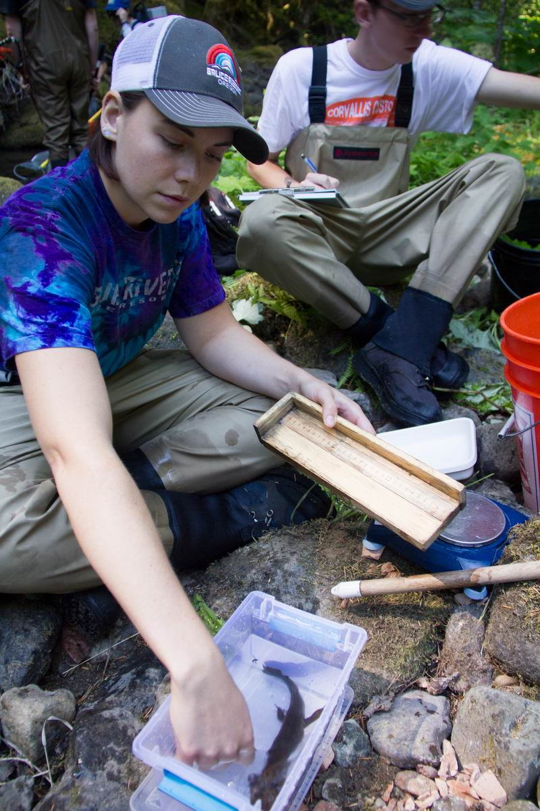
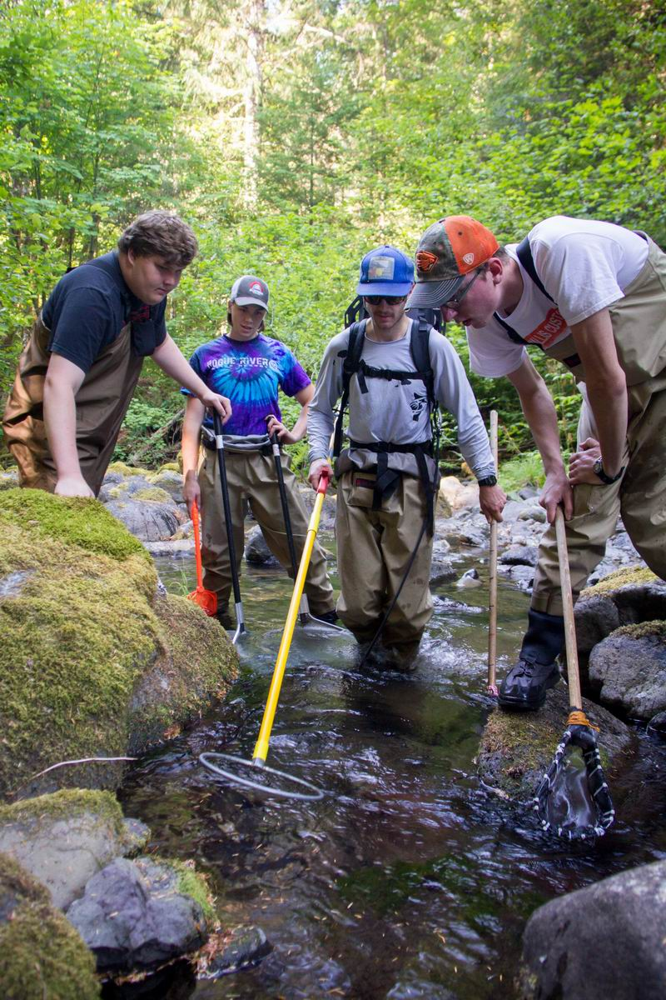

```{r setup, echo = FALSE, message = FALSE, warning = FALSE, cache = FALSE}
knitr::opts_chunk$set(echo = FALSE, message = FALSE, warning = FALSE, cache = FALSE)
```


## Introduction

Ecosystem services provided by production forests of the Pacific Northwest are necessary for the health of our economy, our environment, and our society and culture. The timber extraction technique of clear cutting forests is commonly used in the Pacific Northwest region, but it has been widely criticized for negatively impacting biodiversity^[Seedre, M., Felton, A. & Lindbladh, M. What is the impact of continuous cover forestry compared to clearcut forestry on stand-level biodiversity in boreal and temperate forests? A systematic review protocol. Environ Evid 7, 28 (2018) doi:10.1186/s13750-018-0138-y]. In order to study the effects of clear cutting on biodiversity, amongst other things, researchers in Oregon have been monitoring populations of the Pacific Giant Salamander, *Dicamptodon tenebrosus* since 1993^[Gregory S. V. 2016. Aquatic Vertebrate Population Study in Mack Creek, Andrews Experimental Forest, 1987 to present. Environmental Data Initiative. https://doi.org/10.6073/pasta/5de64af9c11579266ef20da2ff32f702. Dataset accessed 12/01/2019.].
                                                                                                                                                                                                                  
                                                                                           

## Data and Methods

The ongoing data collection is monitored by researchers from Oregon State University on the H.J. Andrews Experimental Forest in the central Oregon Cascades. The two long term ecological research study sites are located in Mack Creek. One site is located in a section of forest that was clear cut circa 1963, and the other is located upstream in a 500-year-old section of coniferous forest^[Gregory S. V. 2016. Aquatic Vertebrate Population Study in Mack Creek, Andrews Experimental Forest, 1987 to present. Environmental Data Initiative. https://doi.org/10.6073/pasta/5de64af9c11579266ef20da2ff32f702. Dataset accessed 12/01/2019.].The salamanders at each site are caught, measured, weighed, then released. The data is available via the Environmental Data Initiative under the title *Aquatic Vertebrate Population Study in Mack Creek, Andrews Experimental Forest, 1987 to present*. 

The variables used in this report include the size (length in millimeters and weight in grams) and location, clear cut or old growth, then further sorted into the classifications of cascade, pool, isolated-pool or side-channel, from 1993 to 2017. The differences between salamander weights were determined by performing Welch's Two Sample T-tests with a 95% confidence interval and a significance level of (p = 0.05) using R studio Version 1.2.1335.

## Results
***


```{r}
# -------------------------------------------
# Attach packages
# -------------------------------------------

library(tidyverse)
library(janitor)
library(here)
library(RColorBrewer)
library(tidyr)
library(directlabels)
library(plotly)
library(effsize)
library(kableExtra)

# -------------------------------------------
# Read in Mack Creek Vertebrates data
# -------------------------------------------

vertebrates_raw <- read_csv("mack_creek_vertebrates.csv") 

# Create data frame with only the data we will need to use in our analysis, clean names, lubridate date column, add a count column grouped by year and section, add columns with de-coded section and classification names

vertebrates <- vertebrates_raw %>%
  clean_names() %>%
  filter(species == "DITE") %>%
  select(year, sitecode, section, reach, unittype, length1, weight, sampledate) %>%
  mutate(date = lubridate::mdy(sampledate)) %>%
  group_by(year, section) %>%
  add_tally() %>%
  ungroup() %>%
  mutate(Section = recode(section,
                           CC = "Clear Cut",
                           OG = "Old Growth"),
         classification = recode(unittype,
                                 C = "Cascade",
                                 I = "Riffle",
                                 IP = "Isolated Pools",
                                 P = "Pool",
                                 R = "Rapid",
                                 S = "Step",
                                 SC = "Side Channel"))
  
```

### Salamander counts in Mack Creek

#### Comparison of annual salamander abundance in old growth versus clear cut sections of Mack Creek

```{r}
# Create linegraph of salamander abundance over time in old growth and clear cut sections
ggplot(data = vertebrates,
       aes(x = year,
           y = n,
           group = Section,
           color = Section)) +
  geom_line(show.legend = FALSE) +
  xlim(1992, 2022) +
  geom_dl(aes(label = Section), 
          method = list(dl.trans(x = x + 0.2), "last.points", cex = 0.8)) +
  labs(x = "Year",
       y = "Salamander Counts in Mack Creek",
       caption = "Figure 1. Salamander abundance in old growth and clear cut sections of Mack Creek are shown from 1993 to 2017.") +
  theme_classic()

```


#### Comparison of salamander abundance by channel classification in old growth and clear cut sections of Mack Creek


```{r}
# Filter out salamander observations where classification in Isolated Pools, then create count table of classification and section
salamander_counts <- vertebrates %>%
  filter(classification == c("Cascade", "Riffle", "Pool", "Rapid", "Step", "Side Channel")) %>%
  filter(year == 2017) %>%
  count(classification, Section) %>%
  pivot_wider(names_from = classification, values_from = n)


# Make a nice contingency table with janitor adorn
salamander_props <- salamander_counts %>% 
  janitor::adorn_percentages(denominator = "row") %>% 
  adorn_pct_formatting(digits = 0) %>% 
  adorn_ns(position = "front") %>%
  rename(Section = Section)

kable(salamander_props,
      caption = "Table 1. 2017 salamander counts by channel classification in old growth and clear cut sections of Mack Creek") %>% 
  kable_styling()
  
```

```{r}
# Use chi square test to determine the significance of the difference in where in the channel salamanders are located between the two sections

chi_counts <- salamander_counts %>% 
  select(-Section)

# Run chi-square:
channel_chi <- chisq.test(chi_counts)

channel_chi

```

According to our Chi-squared test for independence, there is not a significant effect of forest condition on where in the channel salamanders are found. 


### Salamander weights in Mack Creek

#### Salamander weights in clear cut versus old growth sections in 2017

```{r}
# We use an unpaired two sample t-test to compare salamander weights in clear cut vs. old growth sections in 2017
vertebrates_2017 <- vertebrates %>%
    filter(year == 2017)

CC_2017 <- vertebrates %>%
  filter(section == "CC")
  
OG_2017 <- vertebrates %>%
  filter(section == "OG")

summary_CC_2017 <- CC_2017 %>%
  summarize(
    mean_weight = mean(weight, na.rm = TRUE),
    sd_weight = sd(weight, na.rm = TRUE),
    salamander_number = n())

summary_OG_2017 <- OG_2017 %>%
  summarize(
    mean_weight = mean(weight, na.rm = TRUE),
    sd_weight = sd(weight, na.rm = TRUE),
    salamander_number = n())

weight_2017_ttest <- t.test(weight ~ Section, data = vertebrates_2017)
weight_2017_cohen <- cohen.d(weight ~ Section, data = vertebrates_2017)
weight_2017_ttest

```

In 2017, the mean salamander weight at the clear cut sites was `r round(summary_CC_2017$mean_weight, 2)`, and the mean salamander weight at the old growth sites was `r round(summary_OG_2017$mean_weight, 2)`. The mean lobster size between clear cut sites and old growth sites did not differ significantly (t(`r round(weight_2017_ttest$parameter, 2)`) = `r round(weight_2017_ttest$statistic, 2)`, p = (`r round(weight_2017_ttest$p.value, 4)`) with a small effect size of `r round(weight_2017_cohen$estimate, 2)`. 


#### Salamanders weight in pools, cascades and side-channels in 2017

```{r}
# We use a one-way ANOVA to compare the weights of salamanders in pools, cascades and side-channels of Mack Creek in 2017

# First we visualize the distribution of weights by classification using a histogram and a qq plot
ggplot(data = vertebrates_2017, 
       aes(x = weight)) +
  geom_histogram(aes(fill = classification),
                 alpha = 0.5,
                 show.legend = FALSE,
                 bins = 15) +
  facet_wrap(~classification, scales = "free")

ggplot(data = vertebrates_2017, 
       aes(sample = weight)) +
  geom_qq(aes(color = classification),
                 alpha = 0.5,
                 show.legend = FALSE) +
  facet_wrap(~classification, scales = "free")

# This data does not look normally distributed, however we have a very large sample size so we will still use an ANOVA test to compare means


```


## Summary

## References

